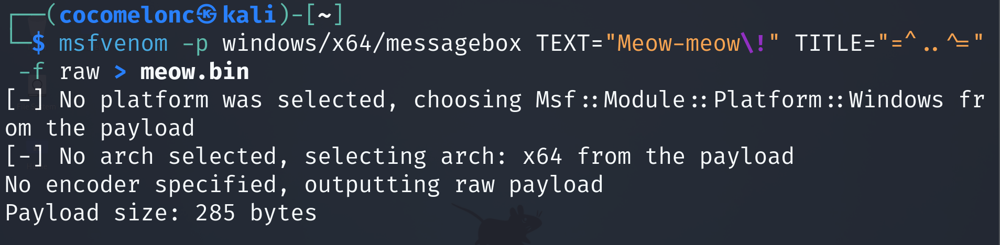
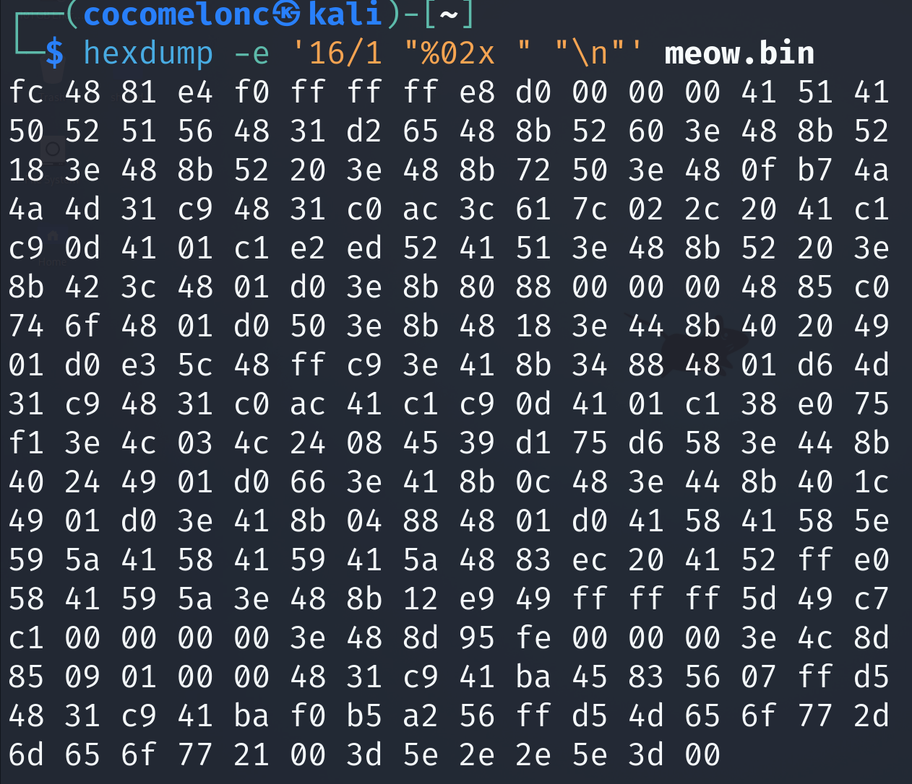

# Meow

Run `msfvenom` for generate payload:    

```bash
msfvenom -p windows/x64/messagebox TEXT="Meow-meow\!" TITLE="=^..^=" -f raw > meow.bin
```

      

Hex value:     

```bash
hexdump -e '16/1 "%02x " "\n"' meow.bin
```

    

Used by [me](https://github.com/cocomelonc) for blog articles and books.      